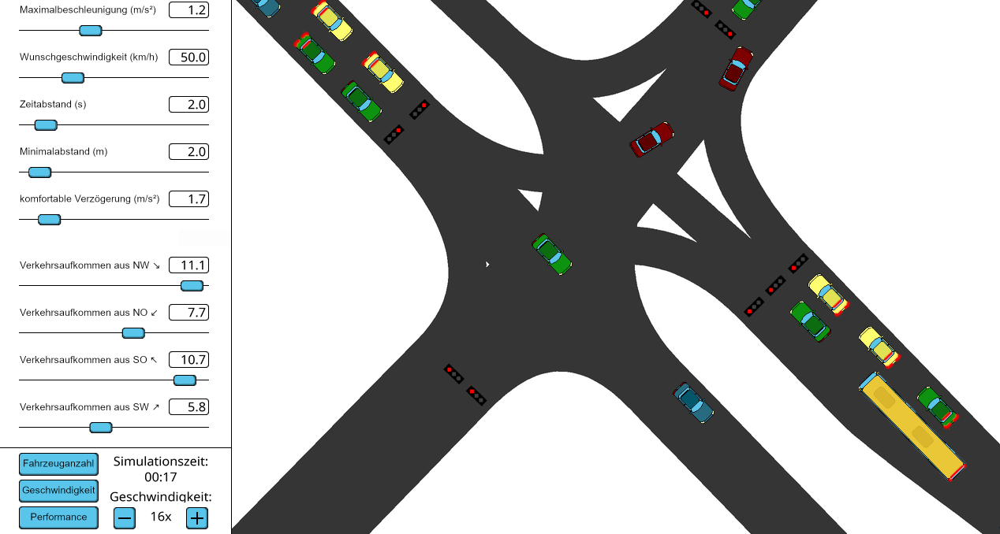

# Simple Traffic Simulation of a Single Intersection

## Showcase

## Motivation

This simulation was made for a project at the University of Rostock, with the motivation of simulating 
an intersection close to our main building to see whether it is possible to improve the intersection.

As that is quite an ambitious project we limited our scope to solely simulating road users, i.e. no
bikes, pedestrians or trams. It only simulates cars, buses and trucks. 

The simulation is capable of simulating arbitrary intersections, due to limitations with python
these can't be all that big though.

## Requirements

Python 3 is required for this project. It requires no installation other than its dependencies,
which you can install here:

`pip3 install -r requirements.txt`

Note that specific versions of `arcade` and `bezier` are required since newer versions introduced 
differences which were interfering with our implementation.

## Introduction to the project structure

The python files in the parent directory are all different ways of running the simulation.

`python3 gui-sim.py` runs a graphical user interface to visually show the simulation

`python3 speed-test-sim.py` runs the simulation without a graphical interface, to test the maximum speed of the simulation

As you can see the visualizer and the simulator are separated from each other therefore the simulation can 
work entirely without the visualizer.

### Subfolders

- Simulator - Contains the simulator
- Visualisation - Contains the gui which can draw 
- Data - The data when running the simulation is saved here
- Evaluation - Data evaluation from the data we have been given
- Intersections - A number of intersections which can be loaded in the simulation

### Loading a different intersection

There is no way of loading a different intersection without editing code right now. 
To change the intersections go to Simulator/simulator.py, then change `real_intersection` to
one of the other possible intersections. For example `threeway_intersection`.

## License

GPLv3, see LICENSE
